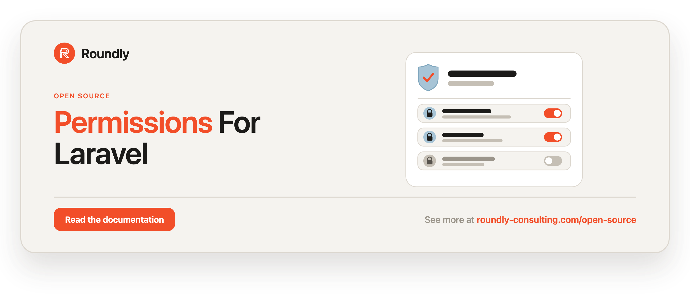

<!-- roundly-hero:start -->
<p align="center">
  <a href="https://roundly-consulting.com/open-source/docs/permissions-for-laravel?utm_source=github&utm_medium=readme&utm_campaign=open-source&utm_content=permissions-for-laravel">
    
  </a>
</p>
<!-- roundly-hero:end -->

<!-- roundly-badges:start -->
<p align="center">
  <a href="https://packagist.org/packages/roundly-consulting/permissions-for-laravel"></a>
  <a href="https://github.com/roundly-consulting/permissions-for-laravel/actions/workflows/run-tests.yml"></a>
  <a href="https://github.com/roundly-consulting/permissions-for-laravel/actions/workflows/fix-php-code-style-issues.yml"></a>
  <a href="https://donate.stripe.com/dRmeVe8FX5PF1Qd9pXcEw00"></a>
  <a href="https://www.patreon.com/cw/roundly"></a>
  <a href="https://roundly-consulting.com/support-us?utm_source=github&utm_medium=readme&utm_campaign=open-source&utm_content=permissions-for-laravel#crypto"></a>
</p>
<!-- roundly-badges:end -->

# Permissions for Laravel

Roles & permissions for Laravel — native, single-guard, cache-backed. Give any
authenticatable model roles and direct permissions, resolve effective permissions
(direct ∪ via-roles), and make Laravel's `can:` gate and middleware authorize against
them. Zero third-party runtime dependencies — a native roles & permissions
system, scoped to what an API service actually needs.

## Requirements

- PHP `^8.4`
- Laravel `^12.0` or `^13.0`

Models that hold roles/permissions default to auto-incrementing `bigint` keys. UUID and
ULID holders are supported via the `key_type` config key — set it **before** you publish and
run the migrations (see [Configuration](#configuration)).

Installs [`roundly-consulting/enums-for-laravel`](https://github.com/roundly-consulting/enums-for-laravel)
for enum conventions,
[`roundly-consulting/package-toolkit-for-laravel`](https://github.com/roundly-consulting/package-toolkit-for-laravel)
for the shared package bootstrapper, and
[`roundly-consulting/translatable-for-laravel`](https://github.com/roundly-consulting/translatable-for-laravel)
for the translatable role/permission `description` (see
[Integrates with](#integrates-with)).

## Installation

```bash
composer require roundly-consulting/permissions-for-laravel
```

Publish the config file — the holder key type is baked into the schema, so set it first:

```bash
php artisan vendor:publish --tag="permissions-config"
```

Then publish and run the migrations:

```bash
php artisan vendor:publish --tag="permissions-migrations"
php artisan migrate
```

**Migrations are publish-only.** The package does not load them, so `php artisan migrate`
creates nothing until you have published them into your app's `database/migrations`. They
land timestamped and in dependency order; publishing again overwrites in place rather than
adding a second copy.

## Configuration

The published `config/permissions.php`:

```php
return [
    'models' => [
        'role' => RoundlyConsulting\Permissions\Models\Role::class,
        'permission' => RoundlyConsulting\Permissions\Models\Permission::class,
    ],

    'table_names' => [
        'roles' => 'roles',
        'permissions' => 'permissions',
        'permission_role' => 'permission_role',
        'model_roles' => 'model_roles',
        'model_permissions' => 'model_permissions',
    ],

    'key_type' => env('PERMISSIONS_KEY_TYPE', 'bigint'),

    'register_gate_check' => true,

    'description_fallback' => RoundlyConsulting\Translatable\Enums\FallbackMode::tryFrom(
        (string) env('PERMISSIONS_DESCRIPTION_FALLBACK', 'fallback')
    ) ?? RoundlyConsulting\Translatable\Enums\FallbackMode::Fallback,

    'cache' => [
        'store' => env('PERMISSIONS_CACHE_STORE', 'default'),
        'key' => 'permissions.cache',
        'ttl' => (int) env('PERMISSIONS_CACHE_TTL', 300), // seconds
    ],
];
```

| Key | Type | Default | Purpose |
|---|---|---|---|
| `models.role` | `class-string` | `Role::class` | Role model; swap for a subclass to extend it. |
| `models.permission` | `class-string` | `Permission::class` | Permission model; swap for a subclass. |
| `table_names.*` | `string` | see above | Table names (column names are fixed). Set before you migrate. |
| `key_type` | `string` | `bigint` (`PERMISSIONS_KEY_TYPE`) | Key type of the holder models — `bigint`, `uuid`, or `ulid`. Drives the `model_id` column on the junction tables. **Set before you migrate** (the schema freezes at release). An unrecognized value falls back to `bigint`. |
| `register_gate_check` | `bool` | `true` | Register the `Gate::before` hook so `can:<permission>` resolves. |
| `description_fallback` | `FallbackMode` | `Fallback` (`PERMISSIONS_DESCRIPTION_FALLBACK`) | How the translatable `description` falls back when the current locale is missing — see [Integrates with](#integrates-with). |
| `cache.store` | `string` | `default` (`PERMISSIONS_CACHE_STORE`) | Cache store for the permission catalog; `default` uses the app store. |
| `cache.key` | `string` | `permissions.cache` | Cache key for the catalog. |
| `cache.ttl` | `int` | `300` (`PERMISSIONS_CACHE_TTL`) | Catalog cache TTL in seconds (short by default as defense-in-depth against bulk writes — see [Cache](#cache)). |

There is **no guard concept**: no `guard_name` column, config, or parameter. The package
is single-guard by design.

### Holder key type

`key_type` describes the models that *hold* roles and permissions, never this package's own
tables (`roles` and `permissions` always own an auto-incrementing key). It types the
`model_id` column on the two junction tables:

| `key_type` | `model_id` column | Use when your holders… |
|---|---|---|
| `bigint` (default) | `unsignedBigInteger` | use Laravel's default auto-incrementing keys |
| `uuid` | `uuid` | use `HasUuids` |
| `ulid` | `ulid` | use `HasUlids` |

```dotenv
PERMISSIONS_KEY_TYPE=uuid
```

## Usage

Everything goes through the `Permissions` facade — or, for dependency injection, the
`PermissionsManager` behind it (see [Without the facade](#without-the-facade)). The
`HasRoles` / `HasPermissions` traits put the grant verbs on your models too; they delegate to
the same manager, so every path runs the same code.

| Method | Returns | Purpose |
|---|---|---|
| `Permissions::role($name)` | `Role` | Find or create a role (as your configured model). |
| `Permissions::permission($name)` | `Permission` | Find or create a permission. |
| `Permissions::findRole($name)` / `findPermission($name)` | `?Role` / `?Permission` | Look one up by name; `null` when missing. |
| `Permissions::roles()` | `Collection<Role>` | Every role, ordered by name. |
| `Permissions::permissions()` | `Collection<Permission>` | The cached permission catalog (`id` + `name`). |
| `Permissions::exists($name)` | `bool` | Whether a permission is registered (answered from the cache). |
| `Permissions::syncFrom(Enum::class)` / `syncRolesFrom(Enum::class)` | `SyncResult` | Register a row per case of a backed enum. |
| `Permissions::for($holder)` | `HolderGrants` | Role and permission writes for one holder. |
| `Permissions::cache()->forget()` / `->flushMemo()` | `void` | Flush the catalog cache / this process's memo. |
| `Permissions::pruneOrphans()` | `int` | Delete grant rows whose holder no longer exists. |
| `Permissions::roleModel()` / `permissionModel()` | `class-string` | Your configured model classes. |

Every name-taking method accepts a `string` or a `BackedEnum`.

### Add the trait

Add `HasRoles` to any authenticatable model. There is no `$guard_name` to set.

```php
use Illuminate\Foundation\Auth\User as Authenticatable;
use RoundlyConsulting\Permissions\Concerns\HasRoles;

class User extends Authenticatable
{
    use HasRoles;
}
```

### Create roles and permissions

`role()` and `permission()` are idempotent under the unique `name` index, and they create and
return the model you configured at `permissions.models.*` — so a host subclass gets its own
class back, its own model events, and its own observers:

```php
use RoundlyConsulting\Permissions\Facades\Permissions;

$role = Permissions::role('administrator');
$permission = Permissions::permission('auth.users.view');

// The same thing, from the models:
Role::findOrCreate('administrator');
Permission::findOrCreate('auth.users.view');
```

Look them up or list them:

```php
Permissions::findRole('administrator');        // ?Role
Permissions::findPermission('auth.users.view'); // ?Permission — the full row
Permissions::roles();                           // every role, ordered by name
Permissions::permissions();                     // the cached catalog: id + name only
Permissions::exists('auth.users.view');         // bool, from the cache
Permissions::roleModel()::query()->where(...);  // a query on your configured model
```

Both models carry an optional translatable `description`, powered by
[`translatable-for-laravel`](https://github.com/roundly-consulting/translatable-for-laravel).
Write a per-locale array (or a bare string for the current locale); read it back as a plain
string resolved for the current app locale:

```php
use Illuminate\Support\Facades\App;

$permission->update(['description' => ['en' => 'View users', 'sk' => 'Zobraziť používateľov']]);

App::setLocale('sk');
$permission->description;              // "Zobraziť používateľov"  (current locale)

App::setLocale('en');
$permission->description;              // "View users"

$permission->getTranslations('description'); // ['en' => 'View users', 'sk' => 'Zobraziť …']
$permission->getTranslation('description', 'sk'); // "Zobraziť používateľov"
```

`toArray()`, `toJson()`, and API Resources emit the **resolved locale string**, matching
property access — not the raw JSON map. See [Integrates with](#integrates-with) for the
fallback behaviour and how to change it.

### Bootstrap the catalog from your enums

Keep your permission and role names in backed enums and register them in one call — from a
seeder, a deploy step or a service provider:

```php
use RoundlyConsulting\Enums\Helpers;

enum PostPermission: string
{
    use Helpers;

    case View = 'posts.view';
    case Edit = 'posts.edit';
}

$result = Permissions::syncFrom(PostPermission::class);
$result->created;   // ['posts.edit'] — names registered now
$result->existing;  // ['posts.view'] — names that were already there
$result->changed(); // true

Permissions::syncRolesFrom(RoleName::class); // the same, for roles
```

The sync is **additive**: it never deletes or renames a row the enum does not name, because
other services may register their own permissions in the same tables. Anything that is not a
backed enum throws a `PermissionException`.

### Grant permissions to a role

`givePermissionTo` is **additive** — it never strips grants another caller registered — so
independent services can each register their own permissions safely. `syncPermissions` is
authoritative (the given set becomes the complete set):

```php
$role->givePermissionTo('auth.users.view', 'auth.users.edit'); // additive
$role->syncPermissions(['auth.users.view']);                   // exact set
$role->revokePermissionTo('auth.users.view');

// The same, through the facade:
Permissions::for($role)->givePermissionTo('auth.users.view');
```

### Assign roles and read permissions

```php
$user->assignRole('administrator');
$user->removeRole('administrator');
$user->syncRoles(['editor']);
$user->givePermissionTo('auth.users.view');   // a direct grant
$user->forgetAllAuthorization();              // every role and direct grant

$user->hasRole('administrator');                 // bool
$user->hasRole(['administrator', 'editor']);     // any of

$user->getRoleNames();          // Collection<string>
$user->getDirectPermissions();  // direct grants only
$user->getAllPermissions();     // direct ∪ via-roles, de-duped — the JWT claim source
$user->getAllPermissions()->pluck('name');
```

`Permissions::for($holder)` offers the same write verbs — `assignRole`, `removeRole`,
`syncRoles`, `givePermissionTo`, `revokePermissionTo`, `syncPermissions`,
`forgetAllAuthorization` — and returns the holder:

```php
Permissions::for($user)->assignRole('editor');
Permissions::for($user)->syncPermissions([PostPermission::Edit]);
```

The scope is a boundary. Role writes refuse a model without `HasRoles` (a `Role` holds
permissions, never roles), permission writes refuse a model without `HasPermissions`, and
both refuse a holder that has no key yet — each with a `PermissionException`, before anything
is written. Unknown names throw `RoleDoesNotExist` / `PermissionDoesNotExist`.

### Accept your own enums

Every name-taking method accepts a `string` or a `BackedEnum`, so you can pass your own
permission/role enums (persisted as `->value`):

```php
$role->givePermissionTo(PostPermission::Edit);
$user->hasPermissionTo(PostPermission::Edit);
Permissions::exists(PostPermission::Edit);
```

### Gate & middleware

With `register_gate_check` on, permissions resolve through Laravel's Gate, so the native
`can:` middleware works out of the box:

```php
Route::get('/users', UsersController::class)->middleware('can:auth.users.view');

$user->can('auth.users.view');           // true when granted directly or via a role
Gate::forUser($user)->allows('auth.users.view');
```

The hook returns `null` for any ability that is not a registered permission, so your
custom gates and policies still run untouched. Set `register_gate_check` to `false` to
disable it entirely.

**Permission checks never override model policies.** The hook only answers *argument-less*
ability checks that name one of your permissions. As soon as a check carries a model or any
argument — `$user->can('update', $post)`, or the `can:update,post` middleware — the hook
returns `null` and defers to your gate/policy. So a permission named `update` will authorize
`$user->can('update')`, but `PostPolicy::update()` (ownership, tenancy, …) still decides
`$user->can('update', $post)`. Coarse permissions and model-scoped policies coexist without
one silently swallowing the other.

### Query scope

```php
User::query()->role('administrator')->count();
User::query()->role(['administrator', 'editor'])->get();
```

### Cache

The permission catalog is cached and auto-invalidates on every grant mutation and on any
role/permission save or delete, once that write commits. Inside a transaction (a seeder, or a
migration on Postgres) the shared cache is flushed when the outermost transaction commits, so
a concurrent request can't re-cache the old catalog meanwhile. Until then the writing process
reads the catalog live, so it sees its own changes, and a rollback leaves nothing cached. You
rarely need to flush it manually, but you can:

```php
Permissions::cache()->forget();
```

Or from the CLI:

```bash
php artisan permissions:cache-reset
```

**Bulk writes bypass invalidation.** Auto-invalidation is driven by Eloquent model events,
which mass operations do **not** fire: `Permission::query()->delete()`, `::insert()`,
`::upsert()`, `DB::table('permissions')->...`, and `truncate()`. After seeding or importing
permissions that way, invalidate the catalog explicitly with `Permissions::cache()->forget()`
or `php artisan permissions:cache-reset`. Called inside a transaction, `forget()` flushes now and
again when the transaction commits. (`Permissions::syncFrom()` goes through the models, so it
needs no flush.)

The short default `cache.ttl` (300s) bounds how long a missed invalidation can linger — or a
catalog that a request was already loading at the moment of the commit; use a longer TTL only
if all writes go through Eloquent.

**Octane & queue workers.** The package keeps a small per-request memo on top of the shared
cache store and resets it at each Octane request/task/tick and each queued job, so a
long-lived worker never serves a memo that outlived its authority. Call
`Permissions::cache()->flushMemo()` at any other boundary of a long-lived worker of your own.
For invalidation to propagate *across* workers, use a shared cache store (`redis`, `database`,
`memcached`) — the per-worker `array` store cannot see another worker's flush.

### Cleaning up when a holder is deleted

The `model_roles` / `model_permissions` tables are polymorphic pivots, so they can't foreign-key
the holder table — deleting a user leaves its grant rows behind. If your app ever reuses primary
keys (truncate + reseed, imports, non-autoincrement strategies), a new record inheriting an old
id would silently inherit the deleted holder's roles and permissions. Prevent that in one of two
ways.

Detach grants when the holder is deleted, e.g. from a model `deleting` (or `deleted`) hook:

```php
protected static function booted(): void
{
    static::deleting(fn (self $model) => $model->forgetAllAuthorization());
}
```

Or sweep orphaned rows periodically (e.g. from the scheduler), which deletes pivot rows whose
`model_type` + `model_id` no longer resolve to a model:

```php
Permissions::pruneOrphans(); // int — rows deleted
```

```bash
php artisan permissions:prune-orphans
```

### Without the facade

The facade is sugar over `RoundlyConsulting\Permissions\PermissionsManager` — inject it and
call the same API:

```php
use RoundlyConsulting\Permissions\PermissionsManager;

final class OnboardEditor
{
    public function __construct(private PermissionsManager $permissions) {}

    public function handle(User $user): void
    {
        $this->permissions->for($user)->assignRole($this->permissions->role('editor'));
    }
}
```

Or call the action behind a method directly — each is a small class resolved from the
container: `FindOrCreateRole`, `FindOrCreatePermission`, `GrantRoles`, `RemoveRoles`,
`GrantPermissions`, `RevokePermissions`, `ForgetAuthorization`, `SyncFromEnum`, `PruneOrphans`
(all in `RoundlyConsulting\Permissions\Actions`):

```php
use RoundlyConsulting\Permissions\Actions\GrantRoles;
use RoundlyConsulting\Permissions\Actions\SyncFromEnum;
use RoundlyConsulting\Permissions\Enums\GrantMode;

app(GrantRoles::class)->execute($user, ['editor'], GrantMode::Additive);
app(SyncFromEnum::class)->execute(PostPermission::class, Permissions::permissionModel());
```

The static config resolvers on `RoundlyConsulting\Permissions\Support\PermissionRegistrar` —
`rolesTable()`, `permissionsTable()`, `permissionRoleTable()`, `modelRolesTable()`,
`modelPermissionsTable()`, `keyType()`, `roleModel()`, `permissionModel()` — are public too:
the published migrations call them, and so can your own migrations or raw queries.

### Testing with the fake

`Permissions::fake()` swaps in a recording `PermissionsFake`. Everything still runs against
the database — grants land and the Gate answers — while every write is recorded, whether it
came through the facade, an injected manager, a `for()` handle, the traits,
`Role::findOrCreate()` / `Permission::findOrCreate()` or the artisan commands. Names are
normalized, so an enum matches its string:

```php
$fake = Permissions::fake();

$user->assignRole('editor');
Permissions::syncFrom(PostPermission::class);

$fake->assertRoleAssigned($user, RoleName::Editor);
$fake->assertSyncedFrom(PostPermission::class);
$fake->assertNoPermissionGranted();
```

| Assertion | Negative |
|---|---|
| `assertRoleRegistered($name)` | `assertNoRoleRegistered()` |
| `assertPermissionRegistered($name)` | `assertNoPermissionRegistered()` |
| `assertSyncedFrom($enum)` | `assertNothingSyncedFrom()` |
| `assertRoleAssigned($holder, ?$role)` | `assertNoRoleAssigned()` |
| `assertRoleRemoved($holder, ?$role)` | `assertNoRoleRemoved()` |
| `assertRolesSynced($holder, ?$roles)` — exact set | `assertNoRolesSynced()` |
| `assertPermissionGranted($holder, ?$permission)` | `assertNoPermissionGranted()` |
| `assertPermissionRevoked($holder, ?$permission)` | `assertNoPermissionRevoked()` |
| `assertPermissionsSynced($holder, ?$permissions)` — exact set | `assertNoPermissionsSynced()` |
| `assertAuthorizationForgotten($holder)` | `assertNoAuthorizationForgotten()` |
| `assertOrphansPruned()` | `assertNoOrphansPruned()` |
| `assertCacheForgotten()` | `assertCacheNotForgotten()` |
| `assertMemoFlushed()` | `assertMemoNotFlushed()` |

A refused write (unknown name, wrong holder) is not recorded. The package's own cache
housekeeping — the invalidation after every grant, the memo reset per job or request — is not
recorded either; the cache assertions see only explicit `Permissions::cache()` calls and
`permissions:cache-reset`.

## Integrates with

### `translatable-for-laravel` — the role/permission `description`

The `description` on both `Role` and `Permission` is a real translatable attribute, backed by
[`translatable-for-laravel`](https://github.com/roundly-consulting/translatable-for-laravel).
It is stored as a per-locale JSON map (`jsonb`) and resolves to a plain string for the current
app locale. There is nothing to wire — the trait is applied for you.

```php
$role->update(['description' => ['en' => 'Administrator', 'sk' => 'Administrátor']]);

App::setLocale('sk');
$role->description;   // "Administrátor"
```

**Fallback behaviour is a deliberate, configurable choice** via `permissions.description_fallback`
(env `PERMISSIONS_DESCRIPTION_FALLBACK`). When the current locale has no value:

| Mode | Chain | Notes |
|---|---|---|
| `Fallback` **(default)** | current locale → app `fallback_locale` → `null` | The least-surprising, non-disclosing choice. A description you have not translated for a locale **never** surfaces content from an unrelated language. |
| `None` | current locale → `null` | Exact locale only. |
| `Any` | current locale → app `fallback_locale` → **first available locale** | Descriptions never render blank, but a value left untranslated for one locale can surface in **another** — a cross-locale disclosure. Opt in deliberately. |

Descriptions are developer/admin-facing labels, not user PII, so `Any` is a reasonable opt-in
— it is simply not the default, because silently reaching into an unrelated locale is a
surprise. Override per model with a `protected ?FallbackMode $translatableFallbackMode` property
on your own subclass — an explicit per-model mode always wins over `description_fallback`:

```php
use RoundlyConsulting\Permissions\Models\Role;
use RoundlyConsulting\Translatable\Enums\FallbackMode;

final class AppRole extends Role
{
    protected ?FallbackMode $translatableFallbackMode = FallbackMode::None;
}
```

```dotenv
# Opt into first-available fallback (descriptions never render blank):
PERMISSIONS_DESCRIPTION_FALLBACK=any
```

## Testing

```bash
composer test
```

## Changelog

See [CHANGELOG.md](CHANGELOG.md).

## Contributing

Please open an issue or pull request on the repository.

<!-- roundly-support:start -->
## Support our work

This package is free and open source, built and maintained by
[Roundly Consulting](https://roundly-consulting.com/open-source?utm_source=github&utm_medium=readme&utm_campaign=open-source&utm_content=permissions-for-laravel).
If it saves you time, please consider supporting our open-source work — a one-time donation, a
monthly pledge on Patreon or a crypto donation helps fund maintenance, new features and new
packages.

<a href="https://donate.stripe.com/dRmeVe8FX5PF1Qd9pXcEw00"></a>
<a href="https://www.patreon.com/cw/roundly"></a>
<a href="https://roundly-consulting.com/support-us?utm_source=github&utm_medium=readme&utm_campaign=open-source&utm_content=permissions-for-laravel#crypto"></a>
<!-- roundly-support:end -->

## License

The MIT License (MIT). Copyright (c) Roundly Consulting. See [LICENSE.md](LICENSE.md).
